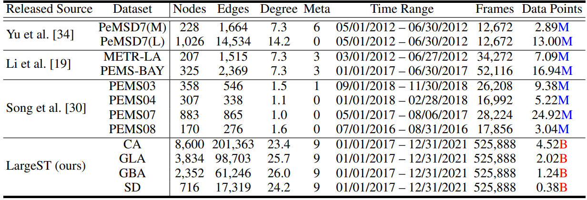
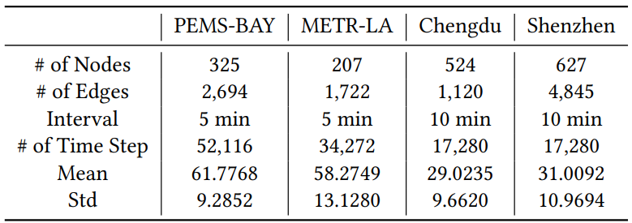
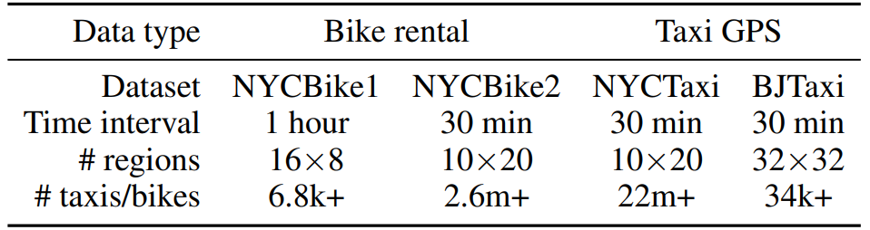
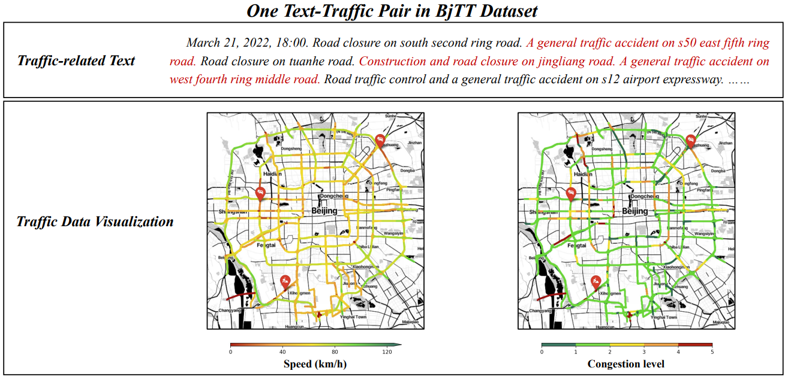
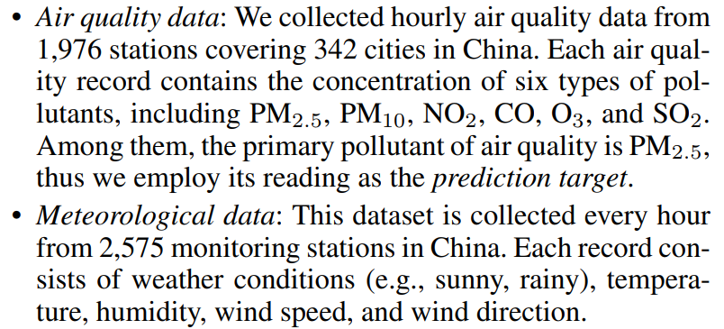

# Datasets

# Spatial-temporal Forecasting

## Transportation

### Traffic Speed/Flow

- LargeST: [Data](https://www.kaggle.com/datasets/liuxu77/largest)
    - Liu et. al. NeurIPS, 2023 ([PDF](https://arxiv.org/pdf/2306.08259.pdf)) ([arXiv](https://arxiv.org/abs/2306.08259)) ([Code](https://github.com/liuxu77/LargeST))

    

        
    

- PEMS03/04/07/08: [Data](https://drive.google.com/drive/folders/14EJVODCU48fGK0FkyeVom_9lETh80Yjp)-[BasicTS](https://github.com/zezhishao/BasicTS)
    - Song et al. AAAI, 2020 ([PDF](https://ojs.aaai.org/index.php/AAAI/article/view/5438/5294)) ([AAAI](https://ojs.aaai.org/index.php/AAAI/article/view/5438)) ([Code](https://github.com/Davidham3/STSGCN))

- METR-LA / PEMS-BAY: [Data](https://drive.google.com/drive/folders/14EJVODCU48fGK0FkyeVom_9lETh80Yjp)-[BasicTS](https://github.com/zezhishao/BasicTS)
    - Li et al. ICLR 2018 ([PDF](https://arxiv.org/pdf/1707.01926.pdf)) ([arXiv](https://arxiv.org/abs/1707.01926)) ([Code](https://github.com/liyaguang/DCRNN))

- EXPY-TKY: [Data](https://github.com/deepkashiwa20/MegaCRN)
    - consists of three-month speed data collected from 1843 links in Tokyo, Japan.
    - TESTAM ICLR 2024 ([PDF](https://openreview.net/pdf?id=N0nTk5BSvO)) ([arXiv](https://openreview.net/forum?id=N0nTk5BSvO)) ([Code](https://github.com/HyunWookL/TESTAM))

- PEMSD7(M/L): [Data](https://github.com/VeritasYin/STGCN_IJCAI-18/issues/6)
    - Yu et al. IJCAI 2018 ([PDF](https://arxiv.org/pdf/1709.04875.pdf)) ([arXiv](https://arxiv.org/abs/1709.04875)) ([Code](https://github.com/VeritasYin/STGCN_IJCAI-18))

- Chendu/Shenzhen: [Data](https://drive.google.com/drive/folders/1UrKTgR27YmP9PjJ-FWv4SCDH3zUxtc5R) - [TPB](https://github.com/zhyliu00/TPB)
    

        
    

    

### Bike Rental Records

- NYCBike1/2: [Data](https://drive.google.com/file/d/1n0y6X8pWNVwHxtFUuY8WsTYZHwBe9GeS/view) - [ST-SLL](https://github.com/Echo-Ji/ST-SSL)

### Taxi GPS Trajectory

- NYCTaxi/BJTaxi: [Data](https://drive.google.com/file/d/1n0y6X8pWNVwHxtFUuY8WsTYZHwBe9GeS/view) - [ST-SLL](https://github.com/Echo-Ji/ST-SSL)

    

        
    

### Multimodal Traffic Data

- BjTT
    - Zhang et al. arXiv 2024 ([PDF](https://arxiv.org/pdf/2403.05029.pdf)) ([arXiv](https://arxiv.org/abs/2403.05029)) ([Code](https://github.com/ChyaZhang/BjTT))

    

        
    

    

## Climate

- Air quality data / Meteorological data
    - AirFormer AAAI 2023 ([PDF](https://arxiv.org/pdf/2211.15979.pdf)) ([arXiv](https://arxiv.org/abs/2211.15979)) ([Code](https://github.com/yoshall/AirFormer))
    
    

        
    

## Crime Prediction

- CHI-Crime / NYC-Crime
    - [data](https://github.com/akaxlh/ST-SHN)
    
    
    

# Long Time-series Forecasting

- ETTh1, ETTh2, ETTm1, ETTm2, Electricity, Exchange Rate, Weather, Traffic, Illness, Beijing Air Quality
    - [Data](https://drive.google.com/drive/folders/14EJVODCU48fGK0FkyeVom_9lETh80Yjp)-[BasicTS](https://github.com/zezhishao/BasicTS)